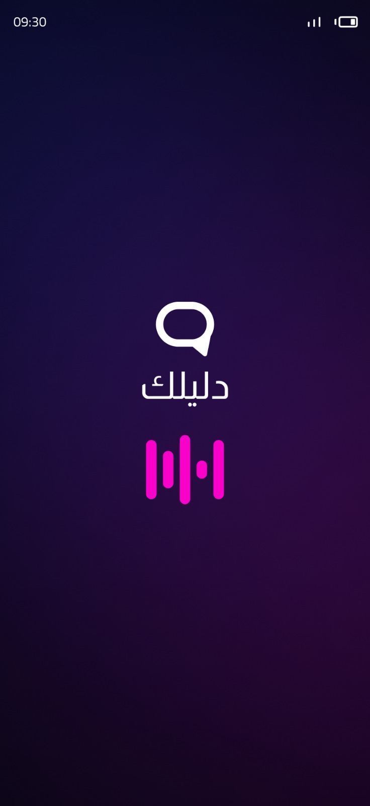
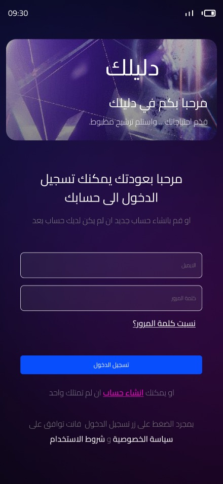
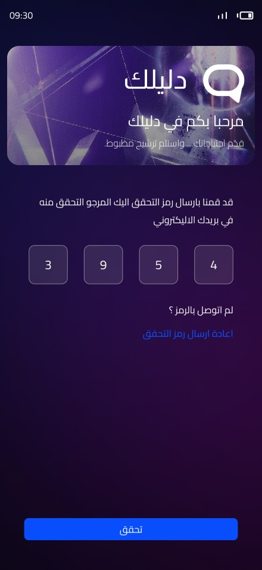
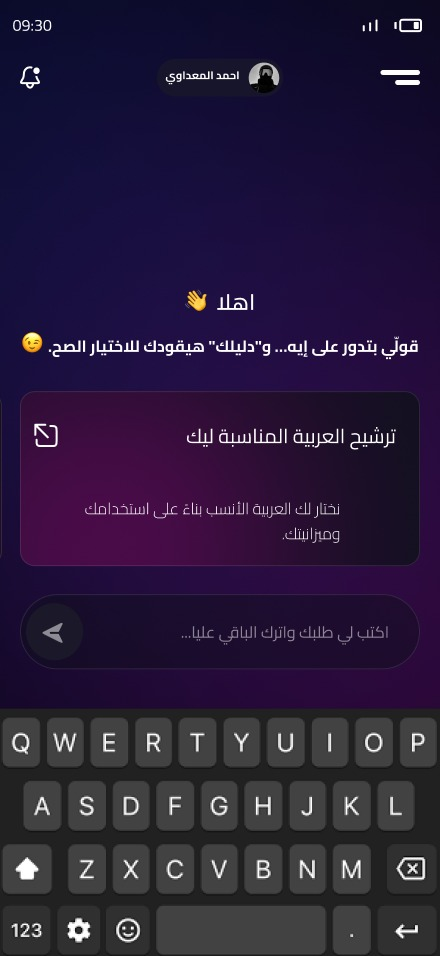
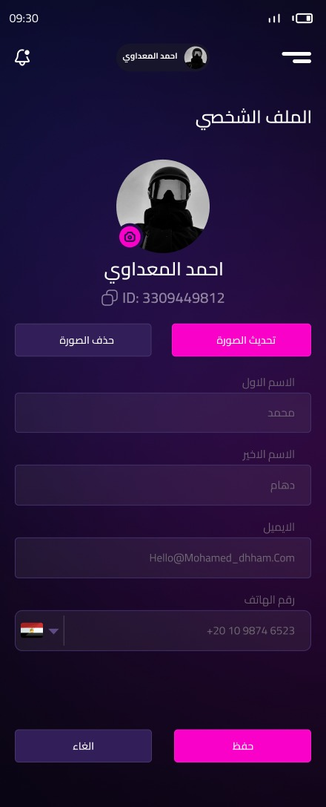

# Dalilak Backend System

## Overview
Dalilak is a backend system developed as a **Graduation Project**, designed to power a real mobile application built with **Flutter**.

The backend handles **authentication**, **OTP verification**, **user management**, and **chat functionality**, following **Clean Architecture** principles to ensure scalability, maintainability, and clean separation of concerns.

This project simulates a real-world production backend integrated with a mobile client.

---

## Mobile Application (Flutter)
The backend system is actively consumed by a real **Flutter mobile application (APK)**, demonstrating full backend–mobile integration.

### Supported Features:
- User authentication and OTP verification  
- User profile management  
- Chat system with session management  
- Secure RESTful API communication with the Flutter client  

---

## Application Screenshots

| Splash | Login | OTP Verification |
|--------|-------|------------------|
|  |  |  |

| Home | Chat | Profile |
|------|------|---------|
|  |  |  |

---

## Key Features

### Authentication & User Management
- User registration with email verification via OTP  
- Secure login/logout using JWT token-based authentication  
- Access token and refresh token support  
- Change password for authenticated users  
- Forgot password and reset password with OTP verification  
- Update user profile information  
- Delete user account with confirmation  
- Email services for OTP and notifications  

### Chat Services
- Create, rename, and delete chat sessions  
- Send and receive messages within sessions  
- Retrieve chat history  
- Paginated message results for better performance  

---

## Architecture
The backend follows **Clean Architecture** with clear separation of concerns:

- **API Layer**  
  Handles HTTP requests, routing, authentication, authorization, and global error handling.

- **Application Layer**  
  Contains business logic, use cases, and application services.

- **Domain Layer**  
  Includes core entities, business rules, and interfaces.

- **Infrastructure Layer**  
  Handles database access, external services, and persistence logic.

### Project Structure
DalilakAPI
├── API
│ ├── Controllers
│ ├── Middlewares
│ ├── Filters
│ └── Program.cs
├── Core
│ ├── Entities
│ ├── Interfaces
│ └── DTOs
├── Services
│ ├── Implementations
│ └── Helpers
├── Repository
│ ├── Context
│ ├── Repositories
│ └── Migrations
└── screenshots
---

## Technology Stack
- **.NET 6**
- **ASP.NET Core Web API**
- **Entity Framework Core**
- **SQL Server**
- **JWT Authentication**
- **Swagger / OpenAPI**

---

## API Documentation
Once the application is running, Swagger UI is available at: https://localhost:7258/

### Sample Endpoints

| Method | Endpoint | Description | Auth |
|--------|----------|-------------|------|
| POST | `/api/auth/register` | Register new user | No |
| POST | `/api/auth/verify-email` | Verify email with OTP | No |
| POST | `/api/auth/login` | User login | No |
| POST | `/api/auth/refresh-token` | Refresh JWT token | No |
| PUT | `/api/auth/update-profile` | Update user profile | Yes |
| GET | `/api/chat/sessions` | Get chat sessions | Yes |
| POST | `/api/chat/send` | Send chat message | Yes |

---

## What This Project Demonstrates
- Building backend systems for real mobile applications  
- Applying Clean Architecture in real-world scenarios  
- Secure authentication and authorization  
- Backend–Mobile (Flutter) integration  
- Writing clean, maintainable backend code  

---

## Author
**Kamal Elsayed**  
Junior Backend .NET Developer  
GitHub: https://github.com/KamalElsayedJR  

---

**Built with ASP.NET Core | Designed for scalability and clean architecture**
